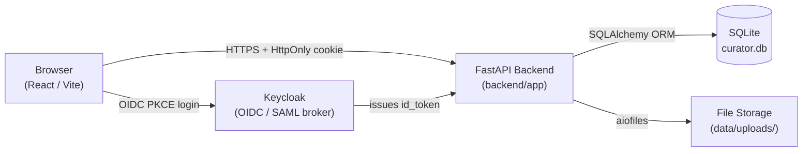

# Image Dataset Curator | Alan Vo | AI & Machine Learning

Current version: `1.0.0`.

An end-to-end computer-vision dataset quality tool for Alan Vo. It solves the practical problem of curating raw image collections before ML training: automatically detecting EXIF privacy leaks, near-duplicate images, and quality outliers, then assigning reproducible train/val/test splits and exporting ML-ready manifests. Intended for ML practitioners who need clean, well-documented image datasets without manual triage.

## AI/ML Evaluation

The core domain engine runs fully offline with deterministic algorithms:

- **Perceptual hashing** (pHash via DCT, aHash, dHash from the `imagehash` library) provides content fingerprints independent of file format or minor encoding differences.
- **Duplicate detection**: Hamming-distance comparison across all pairs in a dataset; configurable threshold (default 8, range 0–64). A threshold of 0 finds exact matches; 8 catches near-duplicates from re-encoding or minor crops.
- **Quality scoring**: Laplacian variance of the luminance channel measures image sharpness; normalised to [0, 1] against a 1000-unit cap.
- **EXIF privacy scan**: Extracts GPS coordinates, camera make/model, author, and software tags using `piexif`; flags any present as issues.

**Reproducible evaluation command:**
```bash
# After installation (see Install / Run below)
python3 -c "
from PIL import Image as PILImage
import io, sys
sys.path.insert(0, 'backend')
from app.services.image_analysis import analyse_image, phash_distance

# Two near-identical images: only 1 pixel differs
img = PILImage.new('RGB', (128, 128), color=(100, 150, 200))
buf = io.BytesIO(); img.save(buf, 'PNG'); data_a = buf.getvalue()
img.putpixel((0, 0), (101, 150, 200))
buf = io.BytesIO(); img.save(buf, 'PNG'); data_b = buf.getvalue()

r_a = analyse_image(data_a)
r_b = analyse_image(data_b)
dist = phash_distance(r_a.phash, r_b.phash)
print(f'pHash distance (1-pixel diff): {dist}  (threshold=8 → detected as duplicate: {dist <= 8})')
print(f'Quality score: {r_a.quality_score:.4f}')
"
```

**Baseline**: Two images identical except for one pixel → pHash distance ≤ 2 (empirically 0–1); re-encoded JPEG at quality 90 of the same image → pHash distance ≤ 4.

**Failure cases**: Solid-color images collapse to the same hash regardless of color; heavy crops (>50 % content removed) may exceed the duplicate threshold even when semantically related.

**LLM advisories** are opt-in, labeled as advisory, and grounded in actual image metadata (dimensions, labels, EXIF issues). They require a configured `LLM_API_KEY` and never fabricate responses when the key is absent.

## Features

| Workflow | Description |
|---|---|
| Upload & Inspect | Upload JPEG/PNG/GIF/WebP/TIFF; auto-extract dimensions, format, mode, file size, pHash/aHash/dHash fingerprints, EXIF privacy issues, and Laplacian quality score |
| Duplicate Detection | Hamming-distance pHash comparison across dataset; configurable threshold; marks secondary copies; returns pair list |
| Split Curation & Export | Deterministic (SHA-256) or seeded-random train/val/test assignment; JSONL, CSV, COCO-lite export |
| EXIF Stripping | Server-side removal of all EXIF metadata from JPEG files with audit log |
| Dataset Management | Create/update/delete datasets with configurable split ratios and label taxonomy |
| LLM Advisories (opt-in) | Advisory quality summaries grounded in real metadata; requires configured provider key |

## Architecture



## API Endpoint Reference

| Method | Path | Auth | Description |
|---|---|---|---|
| GET | `/health` | None | Service health check |
| GET | `/api/login` | None | Initiate OIDC login (PKCE) |
| GET | `/api/callback` | None | OIDC callback; sets session cookie |
| POST | `/api/logout` | Viewer+ | Clear session cookie |
| GET | `/api/me` | Viewer+ | Current user + CSRF token |
| POST | `/api/images` | Analyst+ | Upload and analyse image |
| GET | `/api/images` | Viewer+ | List images (paginated, filtered) |
| GET | `/api/images/{id}` | Viewer+ | Get image detail |
| PATCH | `/api/images/{id}` | Analyst+ | Update labels / split / dataset |
| DELETE | `/api/images/{id}` | Admin | Delete image |
| POST | `/api/images/{id}/strip-exif` | Analyst+ | Strip EXIF from stored file |
| POST | `/api/images/detect-duplicates` | Analyst+ | Run duplicate detection |
| GET | `/api/images/{id}/advisory` | Viewer+ | LLM advisory (opt-in) |
| GET | `/api/images/{id}/file` | Viewer+ | Serve image file |
| POST | `/api/datasets` | Analyst+ | Create dataset |
| GET | `/api/datasets` | Viewer+ | List datasets |
| GET | `/api/datasets/{id}` | Viewer+ | Get dataset detail |
| PATCH | `/api/datasets/{id}` | Analyst+ | Update dataset |
| DELETE | `/api/datasets/{id}` | Admin | Delete dataset |
| POST | `/api/datasets/{id}/assign-splits` | Analyst+ | Assign train/val/test splits |
| GET | `/api/datasets/{id}/stats` | Viewer+ | Split and quality statistics |
| GET | `/api/datasets/{id}/export` | Viewer+ | Export manifest (jsonl/csv/coco) |
| GET | `/api/datasets/{id}/advisory` | Viewer+ | LLM dataset advisory (opt-in) |

## Install / Run

### Local development (without Docker)

**Prerequisites**: Python 3.12, Node 18+.

```bash
# Backend
python3 -m venv .venv
.venv/bin/pip install -r backend/requirements.txt
cp .env.example .env          # fill in OIDC credentials or set DEMO_MODE=true
DEMO_MODE=true .venv/bin/uvicorn app.main:app --app-dir backend --reload --port 8000

# Frontend (separate terminal)
cd frontend
npm install
npm run dev
```

Open http://localhost:5173 (demo mode: auto-login as admin).

### Docker Compose (full stack)

```bash
cp .env.example .env
# Edit .env: set OIDC_CLIENT_SECRET, SESSION_SECRET, KC_ADMIN_PASSWORD
docker compose up
```

Services:
- Backend: http://localhost:8000
- Frontend: http://localhost:5173
- Keycloak: http://localhost:8080 (admin console)

For production, place a TLS-terminating reverse proxy (nginx/Caddy) in front of all services. Set `PRODUCTION=true` in the backend environment to enforce non-demo mode.

### Run tests

```bash
# Backend
PYTHONPATH=backend .venv/bin/python -m pytest backend/tests -q

# Frontend
cd frontend && npm install && npm run build && npm test
```

## LLM Provider Configuration

| Variable | Default | Description |
|---|---|---|
| `LLM_API_KEY` | *(empty)* | Provider API key (server-side only) |
| `LLM_PROVIDER` | `openai-compatible` | `openai-compatible`, `anthropic`, or `gemini` |
| `LLM_MODEL` | `gpt-4o-mini` | Model name for the selected provider |
| `LLM_BASE_URL` | `https://api.openai.com/v1` | Base URL (for OpenAI-compatible / Ollama) |

LLM features are opt-in and labeled advisory. The app operates fully without a key; advisory endpoints return a clear error when `LLM_API_KEY` is absent.

## SSO / SAML Setup

Keycloak is the OIDC provider. It supports upstream SAML IdPs through identity brokering. See [`docs/sso-saml-setup.md`](docs/sso-saml-setup.md) for:
- Keycloak realm import (`keycloak/realm-export.json`)
- Configuring a SAML IdP in Keycloak
- Mapping SAML attributes to Keycloak roles

## Security Notes

- Session tokens are HttpOnly SameSite=Lax cookies; never exposed to JavaScript.
- PKCE (code challenge S256) prevents authorization-code interception.
- CSRF tokens tied to session sub and hour window protect all mutating endpoints.
- `DEMO_MODE=true` is refused when `PRODUCTION=true`. Never enable demo mode in production.
- LLM API keys are never logged or returned to the client.
- This is an open-source portfolio project; it has not undergone a professional security audit. Do not use as-is for sensitive production data without additional hardening.

## Backup / Restore

```bash
# Backup SQLite and uploaded files
docker compose exec backend tar czf /tmp/backup.tar.gz /app/data
docker compose cp backend:/tmp/backup.tar.gz ./backup-$(date +%Y%m%d).tar.gz

# Restore
docker compose cp ./backup-20260101.tar.gz backend:/tmp/backup.tar.gz
docker compose exec backend tar xzf /tmp/backup.tar.gz -C /
```

---

Alan Vo | alanvo@gmail.com
